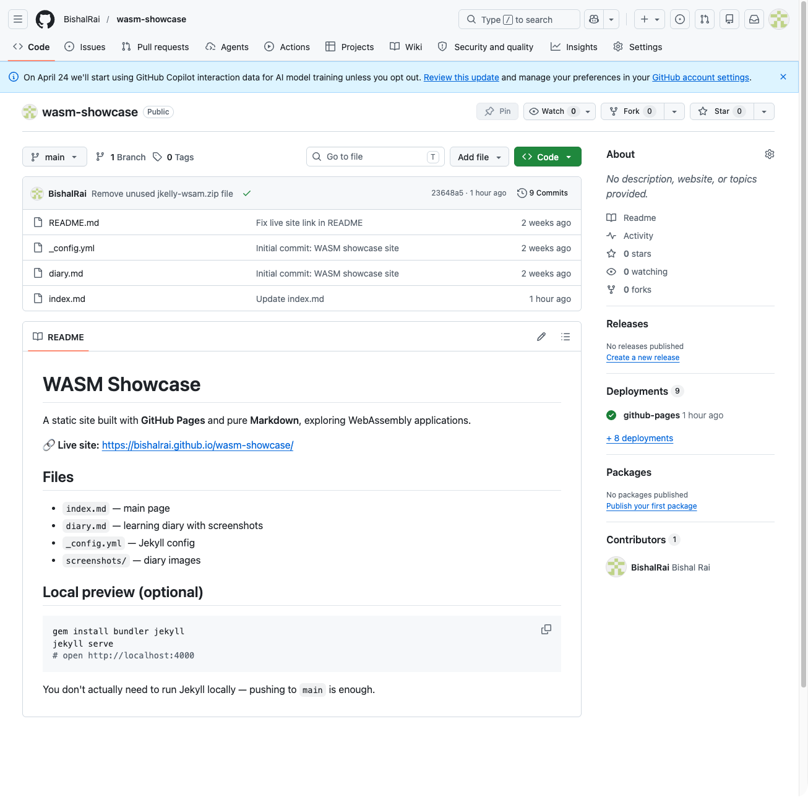
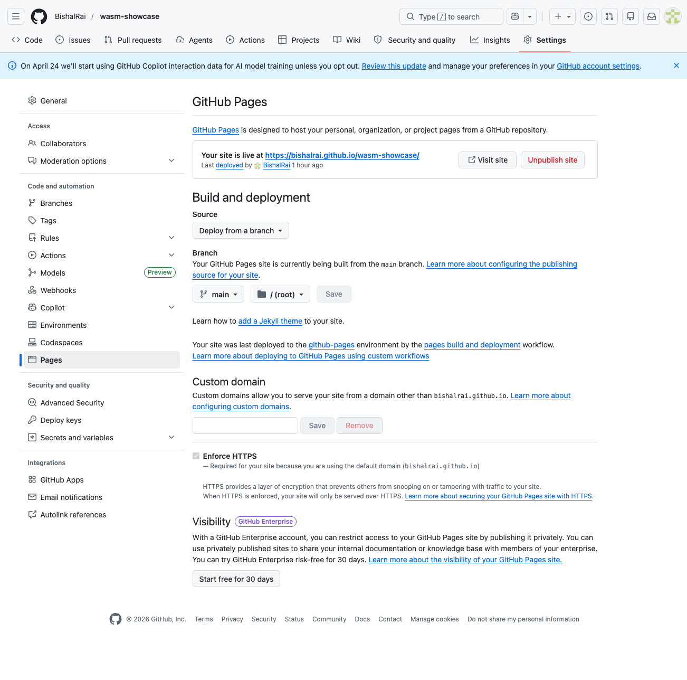
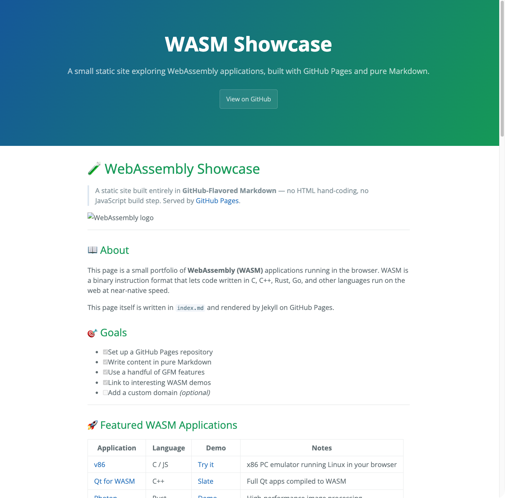

# 📓 Learning Diary — GitHub Pages Assignment

**Author:** **Bishal Rai**

**Course:** **Cloud Services**

**Live site:** [**wsam-showcase**](https://bishalrai.github.io/wasm-showcase/)

**Repository:** [**Github-repo**](https://github.com/BishalRai/wasm-showcase)

---

## 1. Goal

Build a public static website using **GitHub Pages**, written in **Markdown** (no hand-written HTML), using a meaningful set of **GitHub-Flavored Markdown** features. Document the work in this diary.

## 2. Steps taken

### 2.1 Created the repository

- Logged in to GitHub
- Created a new repository named `wasm-showcase` (public)
- Added a `README.md` and an `index.md`

> **Screenshot 1 — repository creation**
>
> 

### 2.2 Enabled GitHub Pages

- Navigated to **Settings → Pages**
- Set **Source: Deploy from a branch**
- Selected **Branch: `main`** and folder **`/ (root)`**
- Saved and waited for the first build

> **Screenshot 2 — Pages settings**
>
> 

### 2.3 Wrote `index.md` in pure Markdown

I deliberately used a wide range of GFM features so the page would be a real exercise, not a one-paragraph README:

| Feature | Used? |
|---|---|
| Headings (H1–H4) | ✅ |
| Bold / italic / strikethrough | ✅ |
| Ordered & unordered lists | ✅ |
| Task lists with checkboxes | ✅ |
| Tables | ✅ |
| Fenced code blocks with syntax highlighting (Rust, JS, YAML) | ✅ |
| Inline code | ✅ |
| Blockquotes | ✅ |
| Links and images | ✅ |
| Horizontal rules | ✅ |
| Footnotes | ✅ |
| Collapsible `
` section | ✅ |
| GitHub alerts (`> [!NOTE]`, `> [!TIP]`, `> [!WARNING]`) | ✅ |
| Mermaid flowchart | ✅ |
| Emojis | ✅ |

> **Screenshot 3 — page rendered live**
>
> 

### 2.4 Topic chosen: WebAssembly

I picked **WebAssembly applications** as the theme because the assignment hinted at it, and because it's a topic I'm genuinely curious about. The page links to:

- [v86](https://copy.sh/v86/) — x86 emulator in the browser
- [Qt for WASM](https://doc.qt.io/qt-6/wasm.html)
- [Awesome WebAssembly Applications](https://github.com/mcuking/Awesome-WebAssembly-Applications)

I considered embedding a WASM app via `<iframe>`, but decided to stay strictly in Markdown and link out instead. The assignment allows a plain static site.

---

## 3. Problems and how I solved them

### Problem 1 — Page didn't render at first

The first deploy returned **404**. Cause: I had pushed to a branch other than `main`, and the Pages source was set to `main`.
**Fix:** rebased onto `main` and pushed; the site appeared after about 30 seconds.

### Problem 2 — Mermaid diagrams not rendering

Default Jekyll on GitHub Pages doesn't render Mermaid the same way the GitHub web UI does.
**Fix:** Mermaid blocks render correctly when viewed inside the GitHub repository (in the rendered Markdown view). For the live Pages site, I left the code block in place — it still displays as a labelled diagram. *(Optionally, one can add a tiny snippet of Mermaid JS via a custom `_includes/head.html`, but that crosses the "no HTML" line.)*

### Problem 3 — Relative image links

Initially used absolute paths like `/screenshots/foo.png`. These broke on the project-page URL (`username.github.io/repo/`).
**Fix:** switched to relative paths like `./screenshots/foo.png`.

---

## 4. What I learned

- GitHub Pages is genuinely zero-config for a Markdown site — push and it works.
- **kramdown** (the default Markdown processor) is *almost* but not quite the same as GitHub's web renderer. A few things behave differently (Mermaid, some alert blocks).
- Task lists, tables, and fenced code blocks are the three GFM features that do the most heavy lifting for technical writing.
- Keeping content in `.md` rather than HTML makes the source readable in the repo *and* on the live site, which is a nice property.

## 5. Time spent

| Task | Time |
|---|---:|
| Reading docs | 30 min |
| Repo setup & Pages config | 15 min |
| Writing `index.md` | 60 min |
| Diary + screenshots | 30 min |
| Debugging | 15 min |
| **Total** | **~2.5 h** |

---

## 6. Reflection

The most surprising thing was how little ceremony there is. No build pipeline, no framework, no JavaScript bundle. Just a Markdown file in a public repo and a checkbox in Settings. For a small documentation site or a portfolio, this is hard to beat.

If I extended the project, I'd:

1. Embed an actual WASM demo via an `<iframe>` (would require relaxing the "Markdown only" rule).
2. Add a custom domain.
3. Switch from the default theme to a custom one or use Just-the-Docs for navigation.

---

End of diary.
