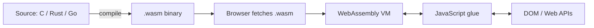

# 🧪 WebAssembly Showcase

> A static site built entirely in **GitHub-Flavored Markdown** — no HTML hand-coding, no JavaScript build step. Served by [GitHub Pages](https://pages.github.com/).


---

## 📖 About

This page is a small portfolio of **WebAssembly (WASM)** applications running in the browser. WASM is a binary instruction format that lets code written in C, C++, Rust, Go, and other languages run on the web at near-native speed.

This page itself is written in `index.md` and rendered by Jekyll on GitHub Pages.

## 🎯 Goals

- [x]  Set up a GitHub Pages repository

- [x]  Write content in pure Markdown  

- [x]  Use a handful of GFM features    

- [x]  Link to interesting WASM demos

- [ ]  Add a custom domain *(optional)*

---

## 🚀 Featured WASM Applications

| Application | Language | Demo | Notes |
|---|---|---|---|
| [v86](https://copy.sh/v86/) | C / JS | [Try it](https://copy.sh/v86/?profile=archlinux) | x86 PC emulator running Linux in your browser |
| [Qt for WASM](https://doc.qt.io/qt-6/wasm.html) | C++ | [Slate](https://www.qt.io/qt-examples-for-webassembly) | Full Qt apps compiled to WASM |
| [Photon](https://silvia-odwyer.github.io/photon/) | Rust | [Demo](https://silvia-odwyer.github.io/photon/demo.html) | High-performance image processing |
| [SQLite WASM](https://sqlite.org/wasm/doc/trunk/index.md) | C | [Fiddle](https://sqlite.org/fiddle/) | SQLite running in the browser |
| [FFmpeg.wasm](https://ffmpegwasm.netlify.app/) | C | [Playground](https://ffmpegwasm.netlify.app/playground) | Transcode video client-side |

A more comprehensive list lives in [Awesome WebAssembly Applications](https://github.com/mcuking/Awesome-WebAssembly-Applications).

---

## 💡 Why WebAssembly?

> WebAssembly is *the* portable compilation target for the web — a sandboxed VM that runs anywhere a modern browser does.

**Three properties that matter:**

1. **Speed** — near-native performance for compute-heavy work
2. **Portability** — same `.wasm` binary runs on every platform
3. **Security** — sandboxed by design, with explicit imports/exports

### Languages that compile to WASM

- C / C++ via [Emscripten](https://emscripten.org/)
- Rust via `wasm-pack` / `wasm-bindgen`
- Go (with caveats around binary size)
- AssemblyScript (TypeScript-like)
- Zig, Kotlin, .NET (Blazor), Python (Pyodide), and ~~Java~~ *(via TeaVM, niche)*

---

## 🛠️ How This Site Was Built

### Repository structure

```text
.
├── index.md          # this page
├── diary.md          # learning diary
├── _config.yml       # Jekyll config
└── README.md         # repo readme
```

### Minimal Jekyll config

```yaml
title: WASM Showcase
description: Static site exploring WebAssembly
theme: jekyll-theme-cayman
markdown: kramdown
```

### A taste of code-block syntax highlighting

```rust
// A trivial Rust function compiled to WASM
#[no_mangle]
pub extern "C" fn add(a: i32, b: i32) -> i32 {
    a + b
}
```

```javascript
// Loading the resulting wasm module
const { instance } = await WebAssembly.instantiateStreaming(
    fetch("add.wasm")
);
console.log(instance.exports.add(2, 3)); // → 5
```

---

## 📊 Performance perspective

A rough comparison of a CPU-bound task (matrix multiplication, ~1000×1000):

| Runtime | Relative time | Notes |
|--------:|--------------:|:------|
| Native C | 1.0× | baseline |
| **WASM** | **~1.2×** | very close to native |
| JavaScript (V8) | ~2–3× | depends heavily on JIT |
| Python | ~50× | interpreted |

> [!NOTE]
> Numbers are illustrative — real benchmarks depend heavily on the workload, browser, and compiler flags.

> [!TIP]
> For image/audio/video processing in the browser, WASM is almost always worth it.

> [!WARNING]
> WASM startup has a one-time compilation cost. For tiny operations, plain JavaScript is often faster overall.

---

## 🧩 Diagram — how WASM fits in the browser



---

## ✅ Task list

- [x] Create repository
- [x] Enable GitHub Pages
- [x] Write `index.md`
- [x] Add learning diary
- [ ] Submit course assignment

---

## 📚 Further reading

<details>
<summary><b>Click to expand the reading list</b></summary>

- [WebAssembly.org — official site](https://webassembly.org/)
- [MDN: WebAssembly](https://developer.mozilla.org/en-US/docs/WebAssembly)
- [Rust and WebAssembly Book](https://rustwasm.github.io/docs/book/)
- [Emscripten Documentation](https://emscripten.org/docs/index.html)
- [Bytecode Alliance](https://bytecodealliance.org/)
- [WASI — WebAssembly System Interface](https://wasi.dev/)

</details>

---

## 📝 Footnotes & inline formatting samples

You can write **bold**, *italic*, ~~strikethrough~~, `inline code`, [links](https://github.com), and even a footnote[^1].

[^1]: Footnotes render correctly on GitHub Pages with the default kramdown processor.

A blockquote with attribution:

> "The web is the largest ungoverned space humans have ever built."
> — *paraphrased, from a talk on WebAssembly*

---

## 📓 Learning Diary

The full learning diary, including screenshots and reflections, lives here:
👉 **[Read the learning diary →](./diary.html)**

---

<sub>Built with ❤️ and Markdown · Hosted on GitHub Pages</sub>
